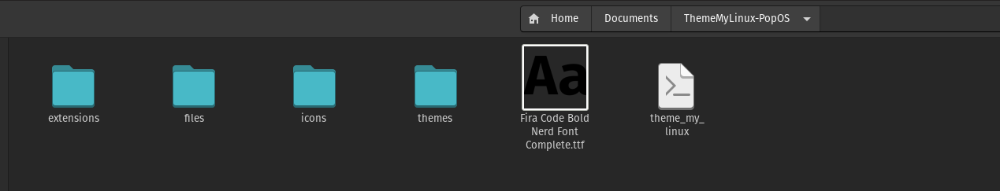

> **Owner** : 🧛🏻‍♂️ - Mr. Sup3rN0va | 19-April-2021

> **Tags** : #linux (🐧), #customization (🥰), #tools (⚒), #wiki (📜)

---

<h2><b>Table of Contents</b></h2>

---

- [**Theme My Linux**](#theme-my-linux)
- [**Installing - Theme My Linux**](#installing---theme-my-linux)
- [**Installing - Gnome Terminal Color Profiles**](#installing---gnome-terminal-color-profiles)
- [**Installing - Boot Animation**](#installing---boot-animation)
- [**Installing - Login Themes**](#installing---login-themes)

---

☝️ <a href="#">Back to top</a> ☝️

---

## **Theme My Linux**

---

* We got you covered :
  * Complete Distro Upgrade
  * Installing apps :
    * `lolcat` : Call rainbow with gradience on console output 🥰🥰🥰
    * `exa` : Replacement for `ls`
    * `sshfs` : Remote mounting drive while on `SSH`
    * `python3-pip` : Python3 `pip` installation
    * `bat` : Replacement for `cat`
    * `snapd` : `SNAP` flatpack installation
    * `screenfetch` : Similar to `neofetch`
    * `gdebi` : Efficient way to `dpkg -i`
    * `gnome-tweak-tool` : Gnome-Desktop customization tool
    * `gnome-shell-extensions` : Gnome-Desktop shell extensions
    * `gnome-shell-extension-system-monitor` : Gnome-Desktop shell extension `system-monitor`
    * `variety` : Automatic Wallpaper changer
    * `procs` : Replacement for `ps`
  * Installing `pip` libraries :
    * `rich` : color library for python
    * `paramiko` : `SSH` library for python
  * Script to apt update in `/usr/bin`. Just type `apt-update` to update the apt and upgrade the distro
  * Copies my favourite `themes`, `icons` and `gnome-shell-extensions`
  * Installing `zsh` and `oh-my-zsh` with its plugins and themes
  * Installing color profiles for Gnome-Terminal
  * Making Gnome-Terminal headless
  * Pop-Shell Tiling feature in Ubuntu
  * New Plymouth Boot Animations
  * `GDM3` Wallpaper Changer or `SDDM` Login Themes

---

☝️ <a href="#">Back to top</a> ☝️

---

## **Installing - Theme My Linux**

---

* Before theming linux

    

* Extract the `zip` and install the `font` first

    

* Run the script : `theme_my_linux`

    

* After theming linux

    

* New `apt update` will be like

    

---

☝️ <a href="#">Back to top</a> ☝️

---

## **Installing - Gnome Terminal Color Profiles**

---

* Best color profiles can be downloaded from GitHub Page : `https://github.com/Mayccoll/Gogh`
* Steps:
  * copy-paste this : `bash -c "$(wget -qO- https://git.io/vQgMr)"`

    

  * My profiles are : `8 22 37 40 132 133 134 205`
  * When prompted, provide these numbers and this will install the respective color profiles

---

☝️ <a href="#">Back to top</a> ☝️

---

## **Installing - Boot Animation**

---

* For this `Plymouth` needs to be installed on the system
* Steps:
  * First check whether `plymouth` is installed or not
  * To check, run : `sudo apt-cache policy plymouth`

    

  * If installed then download `Plymouth Themes` from [**Gnome-Look - Plymouth Themes**](https://www.gnome-look.org/browse/cat/108/ord/rating/)
  * Extract downloaded themes

    

  * Most of the time, these themes comes with the installer script

    

  * If not, then use these steps:
    * Copy the extracted theme folder to `/lib/plymouth/themes` or `/usr/share/plymouth/themes`. You need to check these paths before copying the theme

        

    * Run this to add themes to config list: `sudo update-alternatives --install /usr/share/plymouth/themes/default.plymouth default.plymouth /usr/share/plymouth/themes/<new-theme>/*.plymouth 100`
    * Run this to change the theme : `sudo update-alternatives --config default.plymouth`
    * Run this to update `initramfs`: `sudo update-initramfs -u`

        

  * For fixing delayed booting (Optional)
    * Run : `su` and `echo FRAMEBUFFER=y >> /etc/initramfs-tools/conf.d/splash`
    * Run this to update `initramfs`: `sudo update-initramfs -u`

* Final Boot Animation

    

---

☝️ <a href="#">Back to top</a> ☝️

---

## **Installing - Login Themes**

---

* Default Login Manager for **PopOS** is `GDM3`
* We can use either the same login manager or install `SDDM` which is basically for `KDE`
* Steps
  * For `GDM3`
    * Run: `wget github.com/thiggy01/change-gdm-background/raw/master/change-gdm-background`
    * Then: `chmod +x change-gdm-background`

        

    * Before applying the theme

        

    * To change background wallpaper: `sudo ./change-gdm-background /path/to/image`
    * To change background color: `sudo ./change-gdm-background <COLOR_HEXCODE>`
    * To restore orginal GDM3 Theme: `sudo ./change-gdm-background --restore`
    * **REFERENCE** : [**Github-Thiggy01: Change-GDM-Background**](https://github.com/thiggy01/change-gdm-background)

        

        

  * For `SDDM`:
    * Install pre-requisites: `sudo apt-get install sddm qml-module-qtquick-layouts qml-module-qtquick-controls2 qml-module-qtquick-templates2 qml-module-qtgraphicaleffects qml-module-qtquick-controls plasma-framework -y`
    * While installing `SDDM`, it will prompt you to change the default display manager. Select `SDDM` at that time

        

    * You can download new `SDDM Themes` from [**KDE Store - SDDM Themes**](https://store.kde.org/browse/cat/101/ord/rating/) or from `Github`
    * Extract the downloaded themes

        

    * Testing the theme: `sddm-greeter --test-mode --theme <theme_folder_name>` and copy that to `/usr/share/sddm/themes/`

        

    * If the rendering is ok, then create a soft link as : `sudo ln -s /etc/alternatives/sddm-theme-ubuntu /etc/alternatives/sddm-theme-ubuntu`

        

        

    * Additionlly, you can also create config file manually at `/usr/local/etc/sddm.conf`
    * **REFERENCE** : [**SDDM.Conf - Man Pages**](https://www.freebsd.org/cgi/man.cgi?query=sddm.conf(5)&sektion=&manpath=freebsd-release-ports)

* Final Login Screen

    

> **NOTE**:

>> One important point here is that `SDDM Themes` sometimes have dependencies on `plasma-workspace` which means kindof complete `kde-desktop`. So, we need to test the theme before applying it

>> We can do the testing using `sddm-greeter` command

---

☝️ <a href="#">Back to top</a> ☝️